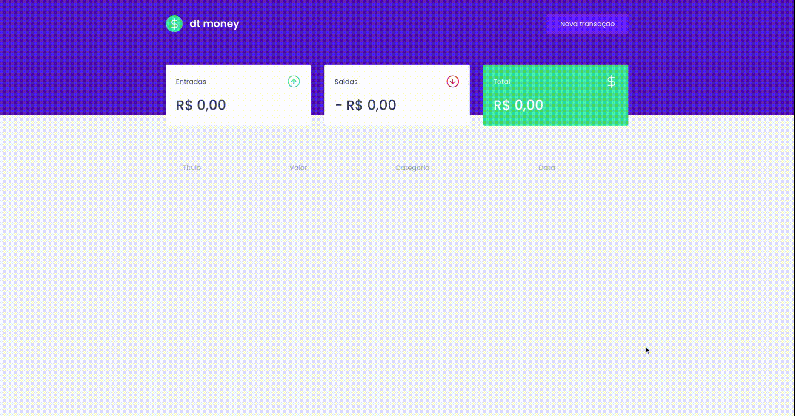
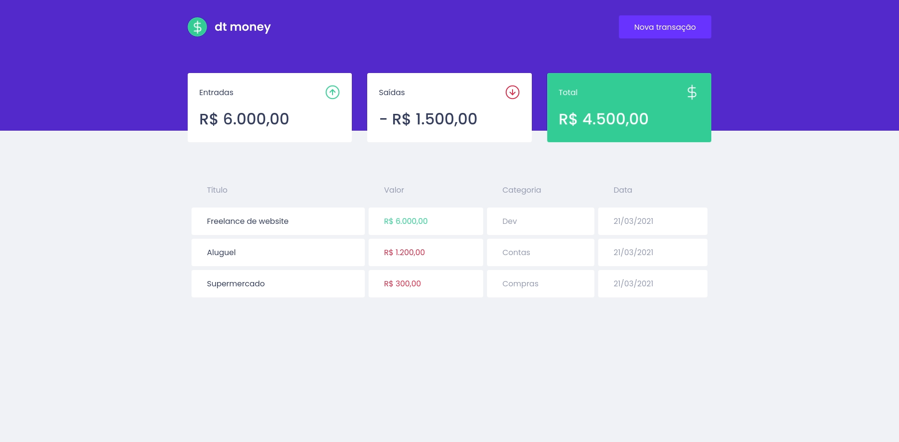
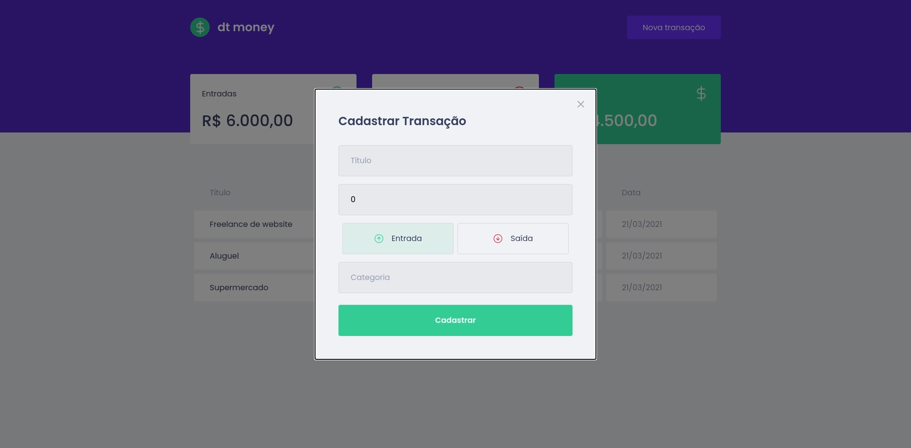
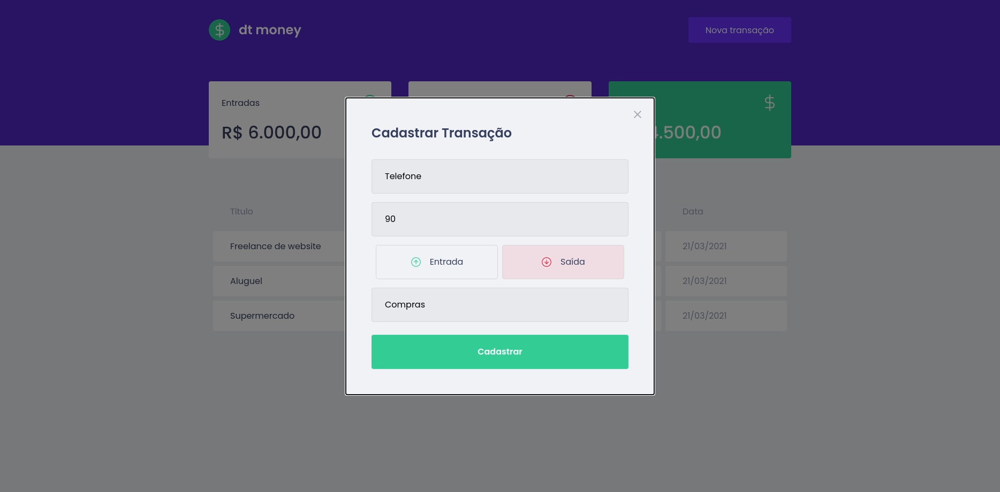

	
	
  
  
  <a href="https://github.com/caiofuccio">
	  
	<a/>
  

 

<h1  align="center">
  
</h1>
 

<h4 align="center">
    💲 dtmoney | Controle financeiro
     
</h4>

 <a href="#-sobre">Sobre</a> •
 <a href="#-funcionalidades">Funcionalidades</a> •
 <a href="#-layout">Layout</a> • 
 <a href="#-como-executar">Como executar</a> • 
 <a href="#-tecnologias">Tecnologias</a> • 
 <a href="#-autor">Autor</a> •
 <a href="#-licença">Licença</a>

 

## 💻 Sobre

O dtmoney é um aplicativo para controle de finanças, onde você pode incluir seus ganhos e gastos a partir de um formulário simples e intuitivo, gerando uma lista com todas as ocorrências listadas com data e categoria, e um resumo apresentando o saldo de entrada, saída e total.

Esse projeto faz parte das aulas da trilha ReactJS do bootcamp Ignite, promovido pela Rocketseat.

-

### Construção

- Para a construção dessa aplicação front-end React, escrita com TypeScript, foi utilizado o conceito de componetização.
- Foram utilizados styled components, para criação do CSS dentro do JS.
- Para criação do front-end sem um back-end foi criada uma Fake API utilizando o MirageJS.
- Foi criado um Fake HTTP utilizando o Axios.
- A formatação dos valores foi feita utilizando o Intl.
- Foi criado um React hook para encapsular um Context API da aplicação, tornando mais fácil sua importação e usabilidade.

---

## ⚙️ Funcionalidades

- Inclusão de novas transações a partir do botão "Nova Transação".
- Visualização das transações cadastradas na página inicial.
- Visualização do saldo de entrada, saída e total.

---

## 🖼️ Layout

 

  
  

---

## 🧰 Como executar

    # Clone o repositório
    $ git clone git@github.com:caiofuccio/dtmoney.git

    # Instale as dependências
    $ yarn

    # Execute a aplicação no modo de desenvolvimento
    $ yarn start

    # A aplicação será aberta na porta:3000 - acesse https://localhost:3000

---

## 🚀 Tecnologias

	
	
	 
	
	
  
	 
  
   
	
---

## 👨‍💻 Autor

	
	 
	<strong>Caio Fuccio</strong>
	 
	 Front-End Developer | ReactJS
	 
	 
	
	

---

## ⚖️ Licença

Este projeto está sob a licença MIT.

Acesse o arquivo de [LICENSE](./LICENSE) para mais informações.
